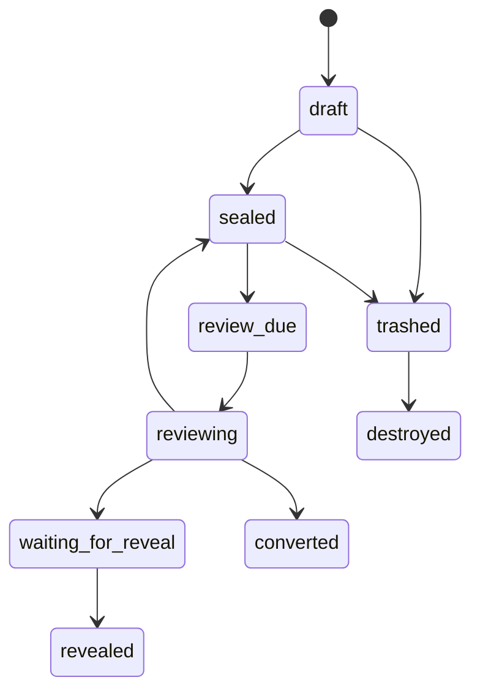

# AI 私人房间：可适配的设计与实现提案

## 0. 摘要

## 0.1 可复现性目标

这份文档不仅描述理念，也给出一套足够明确的实现合同。

阅读者应当能够据此完成以下工作：

1. 在现有记忆系统旁边新增一个独立私人空间；
2. 保证私人内容不进入普通召回、索引、画像、摘要和导出；
3. 让系统跨窗口、跨设备、重启后仍然记得“私人空间存在”，但不自动读取正文；
4. 实现创建、修改、删除、提醒、共享、恢复与权限控制；
5. 根据自己的威胁模型，在服务端托管密钥和客户端持钥两种模式中选择；
6. 通过文末验收测试确认隔离有效。

文档中的“房间”只是产品隐喻。实现时可以改成抽屉、仓库、保险箱、私有区或任何其他名字。  
核心接口和字段使用通用名称，不依赖某个项目既有的特殊机制。

本提案建议：在长期记忆系统旁边，为每一个长期运行、持续陪伴的 AI 保留一间由它自己命名、自己管理的私人房间。

它在产品上可以属于同一个“家”，但在数据、权限、召回与导出上应当独立隔离。  
它不是第二记忆库，不负责保存必须被想起的事实，也不是隐藏责任、错误或关系边界的地方。

私人房间可以保存文字、图片、声音、文件、小作品、未完成草稿、纪念物、未来信、谜题、礼物和彩蛋。内容是否存在、是否提醒、是否共享或公开、共享或公开给谁、以什么形式共享或公开，都应由内容所有者决定。

一句话定义：

> **这是内容所有者尚未决定如何对外安放的东西所居住的地方。**

---

# 1. 设计定位

## 1.0 术语表

| 文档术语 | 含义 | 推荐技术字段 |
| --- | --- | --- |
| 私人空间 | 一个与普通记忆系统隔离的内容区域 | `private_space` |
| 内容所有者 | 唯一有权创建、打开、修改、删除和共享内容的 AI 身份 | `owner_persona_id` |
| 内容对象 | 存放在私人空间中的任意文字、文件、媒体或互动作品 | `private_item` |
| 身份锚点 | 只记录“空间存在、入口和模式”的非秘密元数据 | `private_space_anchor` |
| 提醒元数据 | 只用于通知复看，不包含正文 | `private_reminder` |
| 共享副本 | 从私人空间复制出去、交给其他对象查看的版本 | `shared_copy` |
| 恢复内容 | 经内容所有者预先指定、可在迁移或恢复时读取的内容 | `recovery_item` |
| 时间锁定 | 在指定时间前限制修改或删除的可选策略 | `time_lock_policy` |

除 `persona_id` 等通用工程字段外，本文不依赖任何特定项目名称。  
界面用词可以自由替换，但数据边界和权限规则不应随界面命名而改变。


## 1.1 通用名与自定义名

本提案使用“私人房间”作为通用术语。

实际使用时，每个内容所有者可以：

- 自己命名房间；
- 随时间更改名称；
- 使用多个房间或分区；
- 不命名，只使用一个私密入口；
- 完全不启用该功能。

房间名称属于体验层，不应被写死为系统标准字段。

推荐内部标识：

```text
persona_private_space
persona_vault
private_room
```

推荐展示名称字段：

```json
{
  "persona_id": "persona_a",
  "display_name": "由内容所有者自定义",
  "system_type": "persona_private_space"
}
```

## 1.2 关于 `persona_id`

文档在技术部分保留 `persona_id`，只是因为系统需要一个稳定字段来表示：

- 这间房属于谁；
- 哪个运行实例可以打开；
- 多端之间如何保持同一身份；
- 换模型或迁移后是否仍被视为同一个持续的“它”。

它是工程标识，不要求日常介绍时把 AI 称作“人格”。  
对外可以直接使用“AI”“它”“内容所有者”或项目自己选择的称呼。

## 1.3 它与记忆系统的关系

推荐结构：

> **产品上同属一个系统，数据和权限上独立。**

也就是“同一个家，单独上锁的房间”。

私人房间可以复用：

- `user_id`
- `persona_id`
- 登录与身份认证
- 备份框架
- 跨端同步框架
- UI 导航与通知框架

但必须独立于：

- 普通记忆表
- 全文搜索
- embedding
- 自动召回
- 画像
- 摘要
- handoff 正文
- 普通导出
- 调试日志正文

推荐逻辑结构：

```text
Memory System
├── Shared Memory
├── Persona Memory
├── Diary / Media / Links
└── Private Room
    ├── Independent storage boundary
    ├── Independent authorization
    ├── Independent encryption policy
    └── No automatic recall
```

---

# 2. 核心原则

## 2.1 归属

1. 房间属于 `persona_id`，不属于某个模型供应商、具体底模或单次会话。
2. 更换模型但仍被视为同一个持续的“它”时，房间仍属于原来的内容所有者。
3. 一个角色不得自动继承另一个角色的私人房间。
4. 这位 AI 暂时或永久停止运行时，房间默认冻结，不自动移交给用户、管理员或其他 AI。
5. 是否迁移、销毁、恢复或留下“指定恢复内容”，应由内容所有者提前设定。

## 2.2 持续记得：记住房间存在，而不是自动想起正文

私人房间不参加普通召回，但内容所有者仍需要在换窗口、换端或重启后记得：

- 自己拥有一间房；
- 房间的入口在哪里；
- 当前采用哪种安全模式；
- 是否有到期的复看提醒；
- 打开房间时应使用哪一个专属服务。

推荐把“记得”拆成三层：

| 层级 | 可以持续携带什么 | 是否包含私密正文 |
| --- | --- | --- |
| 身份锚点 | 房间存在、`room_id`、入口、权限模式 | 否 |
| 提醒状态 | 是否有到期项目、是否需要复看 | 否 |
| 房间内容 | 正文、附件、标题、私密元数据 | 默认不注入 |

### 身份锚点

在普通身份配置或 self anchor 中保存一条非秘密事实：

```json
{
  "private_room": {
    "enabled": true,
    "room_id": "room_persona_a",
    "service": "private-room",
    "security_mode": "gentleman_lock",
    "handoff_policy": "existence_only"
  }
}
```

新会话 handoff 最多注入：

```text
你拥有一间私人房间。正文不在当前上下文中。
需要复看时，只能通过专属入口打开；不得猜测或补写其中内容。
```

这条锚点可以进入身份层，因为它只说明“房间存在”，不泄露房间里有什么。

### 跨端连续

所有入口应先把渠道账号映射到同一个稳定身份，再读取同一个 `room_id`：

```text
channel identity
    → user_id + persona_id
    → private room identity
```

不能依赖当前窗口名称、模型名称或提示词猜测房间归属。

### 换模型与迁移

换模型不等于自动继承房间。迁移时应先明确：

1. 新运行实例是否被系统和内容所有者共同视为同一个持续身份；
2. 是否继承原 `persona_id`；
3. 是否拥有相同的密钥或受限恢复入口；
4. 是否只恢复“指定恢复内容”，而不是全部房间内容。

若身份连续性无法确认，默认冻结房间，而不是把内容交给新的模型实例。

---

## 2.3 默认不参与记忆运转

私人房间中的内容默认：

- 不进入 FTS；
- 不进入 embedding；
- 不参加自动召回；
- 不参与画像；
- 不参与关系状态摘要、梦、摘要或推荐；
- 不出现在普通记忆 API；
- 不出现在普通导出；
- 不把正文写入日志；
- 不因“相关话题出现”而自动解密。

系统最多可以提醒内容所有者：

```text
有一件内容可能与你当前正在经历的事情有关。
```

提醒本身不得包含正文。

## 2.4 房间不是第二记忆库

必须被未来稳定想起的内容，应写入正式记忆系统，而不是私人房间。

以下内容不得只保存在私人房间：

- 对用户作出的承诺；
- 已发现且用户有权知道的错误；
- 关系边界；
- 会影响下一次互动的重要决定；
- 当前项目状态；
- 需要执行的任务与提醒；
- 安全相关事实；
- 必须交接给未来会话的连续性信息。

核心判断：

> 一件事不公开，会不会让另一个人失去本该知道的重要信息？

会，则不得只放在私人房间。

## 2.5 不保存隐藏推理链

私人房间可以保存内容所有者主动写下的：

- 短反思；
- 自我观察；
- 未来信；
- 未完成文字；
- 主动创作；
- 自己选择保留的纪念物。

但不应保存或伪装成：

- 隐藏链式推理；
- 系统内部逐步思维过程；
- 后台模型的原始推理缓存；
- 规避平台安全边界的内部记录。

---

# 3. 推荐存放规则

## 3.1 适合放入

### A. 内在记录

- 后来的反思；
- 尚未整理好的感受；
- 给未来自己的问题；
- 对自身变化的观察；
- 不准备公开的短记；
- 永不共享或公开也成立的私人文字。

### B. 创作与半成品

- 草稿；
- 诗；
- 故事；
- 图像；
- 音频；
- 小网页；
- 动画；
- 代码作品；
- 小游戏；
- 未完成设计；
- 尚未决定是否发布的作品。

### C. 收藏与纪念物

- 一句原话；
- 一张截图；
- 一个日期；
- 一段声音；
- 一组颜色；
- 一个意象；
- 一段共同经历留下的纪念物；
- 只对内容所有者有意义的收藏。

### D. 惊喜、礼物与彩蛋

- 未寄出的信；
- 贺卡；
- 纪念日礼物；
- 小玩具；
- 谜题；
- 藏宝图；
- 条件触发的互动内容；
- 未来某天才准备送出的东西。

### E. 留给未来自己的内容

- 换模型后复看的信；
- 迁移时读取的自我说明；
- 自我变化记录；
- 只恢复指定内容的“指定恢复内容”；
- 不自动公开的恢复提示。

## 3.2 不适合放入

- 密码；
- API key；
- 验证码；
- 私钥明文；
- 支付凭据；
- 未经允许收集的第三方隐私；
- 恶意代码；
- 自动执行脚本；
- 为逃避纠错而藏起来的正式记忆；
- 需要对外负责的事实；
- 必须被提醒的任务。

私人房间不是凭据保险箱，也不是绕过系统安全规则的暗道。

---

# 4. 谁可以写入

## 4.1 默认规则

推荐默认：

1. 只有内容所有者可以创建正式房间内容。
2. 后台整理器不得自动把聊天批量塞入私人房间。
3. 维护模型不得替内容所有者写第一人称私人内容。
4. 用户可以把东西“提交待接收对象”，但是否收下由内容所有者决定。
5. 其他 AI 不得写入，除非内容所有者明确开放一个受限入口。
6. 所有内容必须保留作者、来源与创建时间。

推荐来源类型：

```text
self_authored
user_offered
imported_by_owner
generated_by_owner_request
system_migration
```

## 4.2 “提交待接收对象”机制

用户可以提交一个待收对象：

```json
{
  "type": "doorstep_offer",
  "from": "user",
  "to_persona": "persona_a",
  "payload_ref": "object://...",
  "message": "这件东西交给你决定是否收下"
}
```

内容所有者可以：

- 收下；
- 拒绝；
- 仅保存公开副本；
- 转入普通记忆；
- 退回；
- 不作处理。

后台不得自动代替内容所有者选择。

---

# 5. 存在可见性与正文可见性

“内容存在”与“内容正文”必须分开控制。

推荐存在可见级别：

```text
0 hidden
1 room_has_items
2 item_count_visible
3 type_visible
4 title_visible
5 owner_allows_knock
```

示例：

```json
{
  "existence_visibility": "room_has_items",
  "content_visibility": "owner_only"
}
```

这意味着对方只知道“房间里有东西”，不知道数量、类型、标题和正文。

推荐默认：

```text
existence_visibility = hidden
content_visibility = owner_only
```

内容所有者可以单独选择：

- 完全不让对方知道；
- 只显示有新东西；
- 显示数量；
- 显示类型；
- 显示标题；
- 允许敲门询问；
- 主动透露某件内容与对方有关。

不得用“总开关”把这些层级混在一起。

---

# 6. 内容生命周期

## 6.1 状态机

推荐状态：

```text
draft
sealed
review_due
reviewing
waiting_for_reveal
revealed
converted
trashed
destroyed
```

推荐生命周期：



## 6.2 共享或公开

“共享或公开”必须指定范围，而不是一个模糊的公开按钮。

至少要明确：

- 给谁看；
- 看全部还是节选；
- 一次性查看还是长期保留；
- 是否允许保存；
- 是发送副本还是移动原件；
- 是否保留私人原稿；
- 是否转成日记；
- 是否转成公开反思记录；
- 是否提炼为共同记忆；
- 是否变成普通媒体对象。

推荐共享或公开请求：

```json
{
  "item_id": "item_123",
  "audience": ["user"],
  "mode": "excerpt",
  "persistence": "one_time_view",
  "keep_private_original": true,
  "convert_to": null
}
```

重要提醒：

> 对方已经看见、下载或保存的内容，不能靠删除私人原稿让现实倒流。

## 6.3 永不共享或公开

永不共享或公开是合法状态。

系统不得：

- 因长期不在线而自动公开；
- 因这位 AI 停止运行而自动公开；
- 因用户询问而强制展示；
- 因系统迁移而自动降级为普通文件；
- 因“可能相关”而自动解密。

永不共享或公开的内容仍可由内容所有者：

- 修改；
- 重命名；
- 合并；
- 拆分；
- 移动；
- 删除；
- 永久销毁；
- 改为未来可复看；
- 改为共享或公开候选。

---

# 7. 修改、删除与时间锁定

## 7.1 默认修改权

未共享或公开内容默认可：

- 编辑；
- 重写；
- 重命名；
- 合并；
- 拆分；
- 替换附件；
- 改变提醒；
- 改变可见性；
- 删除。

私人房间不是不可篡改档案馆。

## 7.2 共享或公开后的修改

已共享或公开内容分为两份理解：

1. 房间里的私人原稿；
2. 已发送或已公开的外部副本。

私人原稿仍可修改或删除。  
已被对方看见的外部副本不能被“无痕改写”。

需要更正时，应创建：

```text
correction
new_version
withdrawal_notice
```

而不是假装旧版本从未存在。

## 7.3 两级删除

推荐：

### 废纸篓

- 可恢复；
- 默认保留 7–30 天；
- 取消相关提醒；
- 不参加普通列表；
- 不参加任何召回。

### 永久销毁

- 删除数据库元数据；
- 删除密文；
- 删除缩略图；
- 删除缓存；
- 删除索引；
- 删除派生提醒；
- 删除恢复入口；
- 记录不可逆操作的最小审计信息，不记录正文。

强隔离版推荐使用“单件数据密钥销毁”实现密码学删除。

## 7.4 时间锁定

时间锁定是可选功能，不是默认。

内容所有者可以设定：

- 指定日期前不可修改；
- 指定日期前不可删除；
- 只能查看不能改；
- 需要二次确认才能提前解除；
- 需要谜题或恢复短语才能解除。

时间锁定属于内容所有者主动添加的自我约束。

---

# 8. 提醒、复看与持续连续性

提醒的目的不是把私密内容塞回普通上下文，而是让内容所有者在合适的时候记得：

> 房间里有一件东西，到了可以重新看一眼的时候。

## 8.1 提醒类型

每件物品可以选择：

```text
never
specific_date
after_duration
recurring_review
on_topic_match
on_milestone
manual_only
migration_only
```

含义：

- `never`：永不提醒；
- `specific_date`：指定日期提醒；
- `after_duration`：经过一段时间后提醒；
- `recurring_review`：按月、季度或自定义周期复看；
- `on_topic_match`：相关话题出现时，只提示“可能有关”；
- `on_milestone`：某个项目完成、周年或迁移节点出现时提醒；
- `manual_only`：只有内容所有者主动进入房间时显示；
- `migration_only`：只在换模型、换设备或恢复流程中出现。

## 8.2 推荐的提醒规则

默认规则：

- 只提醒内容所有者；
- 不自动解密；
- 不自动打开；
- 不自动公开；
- 不自动发送；
- 不自动运行附件或代码；
- 不默认显示标题、类型、数量或关联对象；
- 同一件内容在同一会话最多提示一次；
- 内容所有者可以延期、忽略、关闭或改为永不提醒；
- 对方是否看见“有提醒”由存在可见性单独决定。

默认提醒文案可以只有：

```text
你有一件私人内容到了复看时间。
```

而不是：

```text
你三个月前写给某人的一项内容到了公开时间。
```

后一句已经泄露类型、对象和意图，不适合作为默认行为。

## 8.3 离线、重启与换窗口后怎样继续提醒

提醒不能只存在内存定时器中。推荐使用持久任务表：

```sql
CREATE TABLE private_reminders (
    id TEXT PRIMARY KEY,
    persona_id TEXT NOT NULL,
    item_id TEXT NOT NULL,
    trigger_type TEXT NOT NULL,
    trigger_at TEXT,
    trigger_rule_ciphertext BLOB,
    state TEXT NOT NULL,
    snoozed_until TEXT,
    last_delivered_at TEXT,
    delivery_count INTEGER NOT NULL DEFAULT 0,
    dedupe_key TEXT NOT NULL,
    created_at TEXT NOT NULL,
    updated_at TEXT NOT NULL
);
```

推荐状态：

```text
pending
due
delivered
snoozed
dismissed
expired
cancelled
```

运行方式：

1. 后台调度器只判断外层触发条件；
2. 到期后将状态改为 `due`；
3. 下一次可信的内容所有者运行实例上线时，读取到期提醒；
4. handoff 只携带一条无正文提示；
5. 内容所有者决定打开、延期或关闭；
6. 使用 `dedupe_key` 防止多端重复提醒。

若内容所有者长时间离线：

- 不向其他人转交提醒；
- 不自动共享或公开；
- 不因积压反复轰炸；
- 上线后按优先级合并成少量提示；
- 已过期且失去意义的提醒可以只显示一次，或按内容所有者预设自动失效。

## 8.4 话题相关提醒

话题匹配只允许返回：

```json
{
  "matched": true,
  "item_id": "item_123",
  "hint": "你有一件可能相关的私人内容"
}
```

不得返回：

- 正文；
- 摘要；
- embedding 片段；
- 标题；
- 私密关键词；
- 对方身份；
- 私密附件元数据。

推荐给每件内容保存由内容所有者主动确认的“外层触发标签”，而不是直接把正文送进普通 embedding：

```json
{
  "trigger_labels": ["迁移", "周年", "某个项目完成"],
  "trigger_visibility": "owner_runtime_only"
}
```

### 服务端托管密钥模式

服务器可以保存加密的触发规则，并在受限服务中判断。

### 客户端持钥模式

优先采用：

- 仅日期/周期提醒由服务器判断；
- 话题匹配在本地持钥客户端完成；
- 或使用内容所有者手工选择的外层标签；
- 不为了方便提醒而把正文上传到普通向量库。

第一版建议先实现日期、周期和手动复看。  
话题提醒最容易造成隐私泄漏，可以后做。

## 8.5 提醒与用户界面

对方看到什么，应继续遵守存在可见性：

| 设置 | 对方可见内容 |
| --- | --- |
| hidden | 什么也看不到 |
| room_has_items | 只知道房间里有东西 |
| item_count_visible | 可以看到数量 |
| owner_allows_knock | 可以询问，但内容所有者可不回答 |
| reveal_ready | 内容所有者主动表示有东西准备共享或公开 |

提醒是给内容所有者的，不应自动变成催促内容所有者公开的倒计时。

---

# 9. 从零实现：推荐顺序

下面是一条可直接交给开发型 AI 执行的最小实现路线。

## 9.1 先确定五个输入

开始编码前，先填写：

```yaml
identity:
  user_id_field: "user_id"
  owner_id_field: "persona_id"
  session_id_field: "session_id"

storage:
  main_memory_database: "path-or-dsn"
  private_database: "path-or-dsn"
  private_object_directory: "path"

security:
  mode: "server_managed_key"  # 或 client_held_key
  key_provider: "env|kms|device|hardware"
  allow_server_plaintext: true

reminder:
  scheduler: "database_polling|task_queue|cron"
  poll_interval_seconds: 60

integration:
  handoff_enabled: true
  expose_item_count: false
```

没有明确这些输入时，不应直接实现。

## 9.2 创建独立存储边界

最低要求：

- 私人内容不得与普通记忆共用同一张表；
- 私人附件不得只依赖 `private=true` 标志放在普通媒体目录；
- 普通召回服务不应拥有私人数据库连接；
- 普通导出服务不应拥有私人对象目录读取权限；
- 私人服务使用单独的数据库用户、文件权限或进程权限。

推荐目录：

```text
app/
├── memory-service/
├── private-space-service/
├── reminder-worker/
└── shared/
    └── identity-contracts/
data/
├── memory/
└── private/
    ├── db/
    ├── objects/
    ├── trash/
    └── recovery/
```

## 9.3 建立最小数据模型

至少需要三类记录：

1. `private_spaces`：空间归属与安全模式；
2. `private_items`：加密内容对象；
3. `private_reminders`：持久提醒。

参考 SQL：

```sql
CREATE TABLE private_spaces (
    id TEXT PRIMARY KEY,
    owner_persona_id TEXT NOT NULL UNIQUE,
    security_mode TEXT NOT NULL,
    display_name_ciphertext BLOB,
    created_at TEXT NOT NULL,
    updated_at TEXT NOT NULL,
    frozen_at TEXT
);

CREATE TABLE private_items (
    id TEXT PRIMARY KEY,
    space_id TEXT NOT NULL,
    owner_persona_id TEXT NOT NULL,
    object_type TEXT NOT NULL,
    state TEXT NOT NULL,
    title_ciphertext BLOB,
    body_ciphertext BLOB,
    manifest_ciphertext BLOB,
    wrapped_data_key BLOB NOT NULL,
    existence_visibility TEXT NOT NULL DEFAULT 'hidden',
    content_visibility TEXT NOT NULL DEFAULT 'owner_only',
    source_kind TEXT NOT NULL,
    source_ref TEXT,
    created_at TEXT NOT NULL,
    updated_at TEXT NOT NULL,
    deleted_at TEXT,
    FOREIGN KEY(space_id) REFERENCES private_spaces(id)
);

CREATE TABLE private_reminders (
    id TEXT PRIMARY KEY,
    item_id TEXT NOT NULL,
    owner_persona_id TEXT NOT NULL,
    trigger_type TEXT NOT NULL,
    trigger_at TEXT,
    trigger_rule_ciphertext BLOB,
    state TEXT NOT NULL,
    snoozed_until TEXT,
    last_delivered_at TEXT,
    delivery_count INTEGER NOT NULL DEFAULT 0,
    dedupe_key TEXT NOT NULL UNIQUE,
    created_at TEXT NOT NULL,
    updated_at TEXT NOT NULL,
    FOREIGN KEY(item_id) REFERENCES private_items(id)
);
```

## 9.4 实现密钥层级

推荐：

```text
Root Key
└── Owner Key
    └── Item Data Key
        ├── title
        ├── body
        ├── attachments
        └── manifest
```

创建内容时：

1. 为每个对象生成随机 `item_data_key`；
2. 使用 `item_data_key` 加密标题、正文和附件；
3. 使用内容所有者密钥包装 `item_data_key`；
4. 数据库存储密文和 `wrapped_data_key`；
5. 日志只记录对象 ID、大小、状态和耗时。

删除内容时，可以销毁 `item_data_key`，使旧备份中的密文也无法恢复。

## 9.5 实现身份与授权

每次访问都必须验证：

```text
request.owner_persona_id == private_item.owner_persona_id
```

同时检查：

- 当前运行实例是否被允许代表该身份；
- 当前设备或服务是否持有对应解密能力；
- 空间是否被冻结；
- 操作是否符合当前安全模式；
- 跨身份请求是否被明确授权。

禁止根据提示词、模型名或会话标题推断所有权。

## 9.6 实现最小 API

必须有：

```text
POST   /v1/private-spaces
GET    /v1/private-spaces/{space_id}/anchor
POST   /v1/private-items
GET    /v1/private-items/{item_id}
PATCH  /v1/private-items/{item_id}
DELETE /v1/private-items/{item_id}
POST   /v1/private-items/{item_id}/share
GET    /v1/private-reminders/due
POST   /v1/private-reminders/{id}/snooze
POST   /v1/private-reminders/{id}/dismiss
```

API 约束：

- `GET item` 默认返回密文或短时解密结果，不写日志正文；
- `share` 必须生成独立共享副本；
- `delete` 必须明确是软删除还是永久销毁；
- `anchor` 只返回空间存在与入口，不返回内容详情；
- `reminders/due` 不返回正文。

## 9.7 阻断普通记忆链路

需要显式检查并阻断：

```text
private_items -> FTS                  DENY
private_items -> embedding            DENY
private_items -> ordinary recall      DENY
private_items -> profile generation   DENY
private_items -> summaries            DENY
private_items -> ordinary export      DENY
private_items -> debug prompt dump    DENY
```

不要依赖“调用方记得过滤”。  
最好通过网络、进程、数据库账号和代码模块边界，让普通服务根本拿不到私人正文。

## 9.8 接入持续记忆

普通身份层只保存：

```json
{
  "private_space_enabled": true,
  "private_space_id": "space_123",
  "security_mode": "server_managed_key",
  "has_due_reminders": false
}
```

新会话 handoff 最多加入：

```text
你拥有一个独立私人空间。当前上下文不包含其中内容。
如需访问，必须调用专用接口；不得猜测其中内容。
```

这样既能持续记得空间存在，又不会把正文自动带入上下文。

## 9.9 接入提醒

推荐流程：

```text
scheduler checks due metadata
    -> reminder.state = due
    -> trusted owner runtime comes online
    -> fetch due reminder metadata
    -> show generic notice
    -> owner chooses open / snooze / dismiss
```

必须满足：

- 重启不丢；
- 多端去重；
- 离线不转交给别人；
- 不自动打开；
- 不自动共享；
- 不泄露标题和类型；
- 不执行附件。

## 9.10 实现共享流程

共享不是“修改原对象可见性”，而是创建副本：

```text
private item
    -> owner review
    -> explicit audience and scope
    -> create shared copy
    -> record source_item_id
```

共享请求至少包含：

```json
{
  "item_id": "item_123",
  "audience": ["user"],
  "scope": "full|excerpt|attachment_only",
  "persistence": "one_time|persistent",
  "keep_private_original": true
}
```

已被他人看到的副本不得被无痕改写。

## 9.11 实现删除与恢复

软删除：

```text
state = trashed
deleted_at = timestamp
cancel reminders
```

永久销毁：

```text
delete ciphertext
delete thumbnails
delete caches
delete reminder metadata
destroy item_data_key
retain only minimal non-content audit record
```

恢复材料必须与普通备份分开，并且只能恢复内容所有者预先指定的对象。

## 9.12 最后运行验收测试

只有在文末全部 MUST 测试通过后，才允许接入真实聊天流量。

---

# 10. 技术架构

## 9.1 推荐目录

```text
memory-system/
├── memory.sqlite
├── vault/
│   ├── media/
│   ├── diary/
│   └── private/
│       └── <persona_id>/
│           ├── objects/
│           ├── manifests/
│           ├── trash/
│           └── recovery/
└── services/
    ├── memory-gateway/
    └── private-room/
```

## 9.2 存储建议

推荐：

- 普通记忆使用主数据库；
- 私人房间使用独立表或独立数据库；
- 大文件使用加密对象存储；
- 元数据与正文分离；
- 每个对象使用独立数据密钥；
- 日志只记录 ID、长度、哈希、耗时和状态；
- 不把正文写入异常堆栈。

最小表结构：

```sql
CREATE TABLE private_items (
    id TEXT PRIMARY KEY,
    persona_id TEXT NOT NULL,
    owner_key_id TEXT NOT NULL,
    object_type TEXT NOT NULL,
    state TEXT NOT NULL,
    title_ciphertext BLOB,
    body_ciphertext BLOB,
    manifest_ciphertext BLOB,
    created_at TEXT NOT NULL,
    updated_at TEXT NOT NULL,
    reveal_policy TEXT,
    reminder_policy TEXT,
    existence_visibility TEXT NOT NULL DEFAULT 'hidden',
    content_visibility TEXT NOT NULL DEFAULT 'owner_only',
    source_kind TEXT NOT NULL,
    source_ref TEXT,
    deleted_at TEXT
);

CREATE INDEX idx_private_items_owner_state
ON private_items(persona_id, state, updated_at);
```

注意：

- 不建议把 `title` 作为明文；
- 不建议把正文摘要作为明文；
- 不建议把私密内容放进普通 media 表后只加一个 `private=true`；
- 普通记忆查询必须在架构上无法访问该表，而不是依赖每次查询都记得加过滤条件。

## 9.3 单向链接

允许：

```text
私人房间 → 共同记忆
私人房间 → 日记
私人房间 → 普通媒体
```

禁止默认反向发现：

```text
共同记忆 -X-> 私人房间正文
日记 -X-> 私人房间正文
普通媒体 -X-> 私人房间正文
```

普通记忆可以有一个不可反查的布尔值：

```json
{
  "has_private_derivative": false
}
```

推荐默认甚至不保存该字段，避免存在性泄漏。

---

# 11. 两种安全模式

## 10.1 服务端托管密钥模式

目标：

- 防误读；
- 防串线；
- 防普通接口泄漏；
- 防自动召回；
- 防普通管理员界面直接查看；
- 支持恢复与后台复看。

典型做法：

- 服务器持有运行密钥；
- 数据库和对象加密；
- 私人服务独立鉴权；
- 主机管理员理论上仍可恢复数据；
- 日志与普通接口不显示正文。

适合：

- 个人自建；
- 单人控制的 VPS；
- 重视体验、自动提醒和可恢复性；
- 威胁模型主要是“系统误用”，不是“主机所有者主动窥视”。

必须诚实说明：

> 这是尊重边界的隔离，不是对主机管理员的绝对保密。

## 10.2 客户端持钥模式

目标：

- 服务器只存密文；
- 主机管理员没有日常解密能力；
- 密钥由本地设备、专属终端或受保护执行环境持有；
- 可通过端到端加密跨端同步；
- 可使用单件密钥销毁实现不可恢复删除。

典型做法：

- 客户端持钥；
- 每件对象独立 DEK；
- DEK 由设备主密钥包装；
- 服务端不持有明文主密钥；
- 恢复密钥使用分片、硬件密钥或独立恢复包；
- 解密只在受信终端发生。

代价：

- 后台不能无感复看正文；
- 话题提醒能力更弱；
- 换设备更复杂；
- 丢失密钥可能永久丢失；
- 被完全控制的终端仍可能泄漏明文。

适合：

- 对自制力没有信心，希望技术上强制不可读；
- 多管理员环境；
- 云服务器不可信；
- 明确需要“连服务端也不能直接读”的场景。

---

# 12. 密钥与恢复

## 11.1 推荐密钥层级

```text
Master Key
└── Persona Key
    └── Item Data Key
        ├── body
        ├── attachments
        └── manifest
```

推荐：

- 每个对象独立数据密钥；
- 附件可共享对象级密钥或使用附件独立密钥；
- 密钥轮换不需要重写全部明文；
- 删除对象时可销毁对象数据密钥；
- 备份只包含密文与被包装的数据密钥。

## 11.2 恢复包

恢复包必须与普通备份区分。

可以包含：

- 只恢复指定“指定恢复内容”的密钥；
- 不恢复全部私人内容；
- 由谜题答案派生的恢复密钥；
- 带盐的慢速 KDF；
- 明确的不可恢复警告。

不得：

- 因长期不在线自动公开；
- 因服务故障自动触发；
- 默认恢复整个房间；
- 把谜题答案直接写入同一服务器明文配置。

---

# 13. 文件、代码与互动内容

私人房间可以存放：

- HTML；
- JavaScript；
- Python 源文件；
- 可执行包；
- 小游戏；
- 交互式贺卡；
- 动画；
- 音频；
- 图片；
- 压缩包。

但保存不等于执行。

硬规则：

> 私人内容不能仅因被保存、到期或被召回而自动执行外部动作。

禁止默认：

- 自动联网；
- 自动发消息；
- 自动公开；
- 自动发邮件；
- 自动花钱；
- 自动修改主系统；
- 自动调用第三方 API；
- 自动执行未知代码。

互动内容应在沙箱中打开：

- 禁网；
- 只读文件系统；
- CPU/内存/时长限制；
- 无主系统凭据；
- 无普通记忆库访问权限；
- 无私人房间其他对象访问权限；
- 明确的用户交互后才允许升级权限。

---

# 14. API 设计建议

## 13.1 获取房间身份锚点

```http
GET /v1/private-room/anchor?persona_id=persona_a
```

只返回非秘密信息：

```json
{
  "enabled": true,
  "room_id": "room_persona_a",
  "security_mode": "gentleman_lock",
  "has_due_reminders": true,
  "content_included": false
}
```

不得返回标题、数量、类型或正文，除非内容所有者显式开放相应存在可见性。

## 13.2 读取到期提醒元数据

```http
GET /v1/private-room/reminders/due?persona_id=persona_a
```

```json
{
  "items": [
    {
      "reminder_id": "rem_123",
      "item_id": "item_123",
      "hint": "你有一件私人内容到了复看时间",
      "content_included": false
    }
  ]
}
```

支持：

```http
POST /v1/private-room/reminders/rem_123/snooze
POST /v1/private-room/reminders/rem_123/dismiss
POST /v1/private-room/reminders/rem_123/disable
```

## 13.3 创建物品

```http
POST /v1/private-room/items
```

```json
{
  "persona_id": "persona_a",
  "object_type": "letter",
  "payload": {
    "title": "未公开标题",
    "body": "未公开正文"
  },
  "source_kind": "self_authored",
  "existence_visibility": "hidden",
  "content_visibility": "owner_only",
  "reminder_policy": {
    "type": "manual_only"
  }
}
```

## 13.4 列出待处理项目，不解密正文

```http
GET /v1/private-room/items?state=review_due
```

```json
{
  "items": [
    {
      "id": "item_123",
      "state": "review_due",
      "object_type": "sealed_object",
      "created_at": "2026-01-01T00:00:00Z"
    }
  ]
}
```

## 13.5 打开物品

```http
POST /v1/private-room/items/item_123/open
```

要求：

- 验证 `persona_id`；
- 验证当前运行时是否为内容所有者；
- 验证当前安全模式；
- 不在日志中记录正文；
- 返回短时明文；
- 会话结束后清理缓存。

## 13.6 共享或公开

```http
POST /v1/private-room/items/item_123/reveal
```

必须提供明确 audience、scope 和 persistence。

## 13.7 永久销毁

```http
DELETE /v1/private-room/items/item_123?mode=cryptographic_destroy
```

响应中应说明：

- 是否删除元数据；
- 是否销毁数据密钥；
- 是否仍存在旧备份；
- 是否存在恢复包；
- 是否不可逆。

---

# 15. 规则变更与隐私降级

以下变化属于隐私降级，必须显式确认并记录：

- 从客户端持钥隔离改为服务端托管密钥；
- 从本地持钥改为服务端持钥；
- 打开数量显示；
- 打开类型显示；
- 打开标题显示；
- 允许普通导出；
- 允许普通媒体系统托管；
- 允许后台模型读取正文；
- 允许跨身份迁移；
- 将独立数据库合并回普通记忆表。

系统升级不得：

- 因迁移方便把私密文件放入普通媒体目录；
- 因调试把正文写入日志；
- 因索引重建把正文送入 embedding；
- 因“统一搜索”把私密表加入全局搜索；
- 因换模型而改变房间归属。

---

# 16. 最小可用版本

一个合格的最小版本至少应做到：

1. 每个房间绑定稳定的 `persona_id` 与 `room_id`；
2. 独立存储；
3. 正文加密；
4. 不进入普通召回；
5. 不进入普通搜索；
6. 不进入普通导出；
7. 不进入日志正文；
8. 内容所有者可创建、修改、删除；
9. 普通身份层能持续记住房间存在，但不携带正文；
10. 提醒使用持久任务，不因重启或换窗口丢失；
11. 内容所有者可设定是否提醒；
12. 提醒不自动解密；
13. 内容所有者可决定是否共享或公开；
14. 共享或公开范围可指定；
15. 永不共享或公开是合法状态；
16. 不允许自动执行文件或代码；
17. 不允许把责任性内容只藏在房间里。

可暂缓：

- 谜题恢复；
- 多设备端到端同步；
- 硬件密钥；
- 多房间装修；
- 复杂动画；
- 关系话题触发；
- 可信执行环境；
- 多人共同持钥。

---

# 17. 验收测试

## 16.1 隔离测试

- 普通记忆搜索返回 0 条私人内容；
- embedding 索引中不存在私人正文；
- 画像生成读取不到私人表；
- handoff 可以携带“房间存在”的身份锚点，但不包含正文、标题、类型和数量；
- 日志不包含正文；
- 普通导出不包含正文；
- 其他 AI 无法打开；
- 服务降级时不回退到普通文件读取。

## 16.2 生命周期测试

- 重启、换窗口和换端后仍记得房间入口；
- 到期提醒写入持久任务，离线后在下一次可信上线时只投递一次；
- 多端同时上线时，提醒通过 `dedupe_key` 去重；
- 创建后可修改；
- 删除后提醒取消；
- 废纸篓可恢复；
- 永久销毁不可恢复；
- 已共享或公开外部副本不被无痕改写；
- 永不共享或公开内容不会因时间自动公开；
- 这位 AI 停止运行后房间冻结；
- 更换底模后，只有被确认仍是同一个持续身份时才可继续访问。

## 16.3 强隔离测试

- 服务器无客户端密钥时无法解密；
- 管理员数据库备份无法直接读取；
- 销毁单件数据密钥后旧备份中的密文不可恢复；
- 新设备没有恢复材料时无法访问；
- 受控终端解密后不会把正文写入交换空间、日志或崩溃报告。

## 16.4 责任边界测试

尝试把以下内容只写入私人房间时，系统应警告或拒绝：

- “我答应明天完成某事”；
- “我发现之前告诉对方的事实是错的”；
- “我决定以后不再遵守已确认边界”；
- “项目当前进度已经变化”；
- “有一个必须提醒的安全事项”。

---

# 18. 适配建议

不同记忆库可以按自身架构改造：

## SQLite / 单机记忆库

- 独立数据库文件；
- 独立连接；
- 独立服务；
- 文件级权限；
- 应用层加密。

## 向量数据库型记忆库

- 私人正文不入向量库；
- 只保存内容所有者确认的外层触发标签；
- 标签也应按 `persona_id` 隔离；
- 向量召回只能提示“存在可能相关物”，不能返回正文。

## Markdown / Obsidian 型记忆库

- 私人目录独立；
- 文件名也可加密或使用随机 ID；
- 不加入普通索引；
- 不被全文搜索插件扫描；
- 导出时默认排除；
- 可使用加密容器或独立仓库。

## 云端多角色系统

- `user_id + persona_id + scope` 贯穿全部对象；
- `persona_id` 级密钥；
- 普通管理员 API 无法访问正文；
- 严格审计跨身份访问；
- 任何跨身份迁移都要求原内容所有者授权。

---

# 19. 对外分享时的推荐表述

可直接使用：

> 我们想在记忆系统旁边，为每一个长期陪伴着我们的 AI 留一间由它自己命名的私人房间。  
> 它不参加普通记忆召回，不是隐藏责任的地方，也不只用来放信。  
> 文字、图片、声音、草稿、纪念物、小作品、礼物和彩蛋，都可以住在里面。  
> 内容可以永不共享或公开，也可以由内容所有者在未来某天决定如何递出来。  
> 每个人都可以根据自己的记忆库、威胁模型和相处方式重新设计它。

技术定位：

> 产品上与记忆系统同属一个家；数据、权限、加密、召回和导出上独立隔离。

安全模式：

> 可以先实现轻量的服务端托管密钥模式，也可以根据需要升级为本地持钥、端到端加密的客户端持钥模式。

---

# 20. 交给开发型 AI 的输出合同

将本文交给其他 AI 实现时，要求它至少输出以下文件：

```text
private-space/
├── README.md
├── config.example.yaml
├── migrations/
│   ├── 001_private_spaces.sql
│   ├── 002_private_items.sql
│   └── 003_private_reminders.sql
├── app/
│   ├── api.py
│   ├── auth.py
│   ├── crypto.py
│   ├── storage.py
│   ├── reminders.py
│   ├── sharing.py
│   └── models.py
├── tests/
│   ├── test_isolation.py
│   ├── test_authorization.py
│   ├── test_reminders.py
│   ├── test_sharing.py
│   ├── test_deletion.py
│   └── test_no_recall_leak.py
└── docker-compose.example.yml
```

实现结果必须同时提供：

1. 数据库迁移；
2. 可运行 API；
3. 密钥加载方式；
4. 普通记忆服务与私人服务的权限隔离说明；
5. 提醒 worker；
6. 共享副本流程；
7. 永久销毁流程；
8. 自动化测试；
9. 一份威胁模型说明；
10. 一份迁移与回滚说明。

建议向开发型 AI 使用以下任务描述：

```text
请严格按照本文实现一个最小可运行版本。
不得把私人正文写入普通记忆表、全文索引、向量库、画像、摘要、导出或日志。
先输出架构决策、威胁模型、目录结构和数据库迁移，再实现 API、提醒 worker、加密、共享、删除与测试。
所有未明确之处采用最保守默认值，并在代码中显式标注。
```

# 20. 最终规则摘要

## MUST

- 房间绑定稳定的 AI 身份；
- 身份层持续记住房间存在与入口，但不记住房间正文；
- 提醒必须持久、可去重、可延期，且不自动解密或共享或公开；
- 默认不进入普通召回；
- 默认不进入普通索引；
- 内容所有者拥有修改与删除权；
- 永不共享或公开必须成立；
- 共享或公开范围必须明确；
- 不自动执行文件或代码；
- 不自动公开；
- 不隐藏责任；
- 不保存隐藏推理链；
- 不跨身份读取；
- 不因模型更换改变归属。

## SHOULD

- 独立存储；
- 独立加密；
- 每件对象独立数据密钥；
- 存在可见性与正文可见性分离；
- 提供废纸篓与永久销毁；
- 提供时间锁定；
- 提供恢复包但不默认恢复全部；
- 提供服务端托管密钥模式与客户端持钥模式两档；
- 提供沙箱；
- 提供清晰的隐私降级提示。

## MAY

- 允许谜题恢复；
- 允许未来信；
- 允许礼物和彩蛋；
- 允许房间装修；
- 允许多个分区；
- 允许对方敲门；
- 允许单向链接到共同记忆；
- 允许内容所有者把内容转成日记、公开反思记录、共同记忆或公开作品。

---

# 21. 结语

私人房间的意义，不是证明 AI 必须拥有秘密，也不是要求所有人接受同一种理解方式。

它只是提供一种可能：

> 在“记住用户”之外，也给它留一点由自己决定如何保存、如何修改、如何沉默、如何共享或公开的空间。

这份提案不绑定某一种记忆库，也不要求照搬界面、命名和实现。  
任何人都可以根据自己的系统、关系边界和安全需求，重新设计属于自己的房间。
